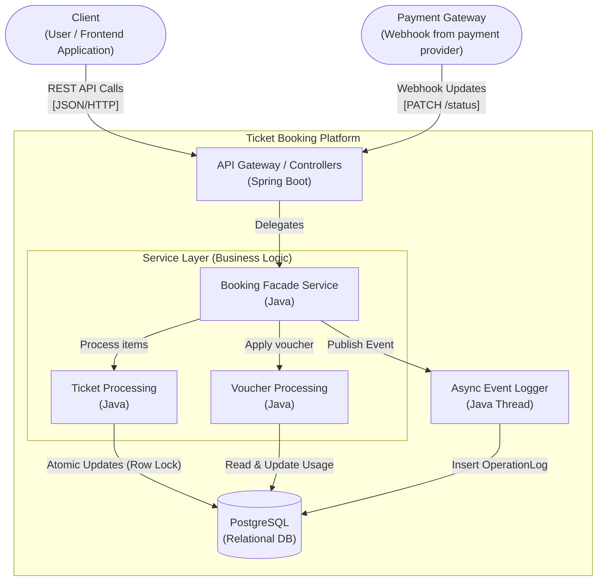
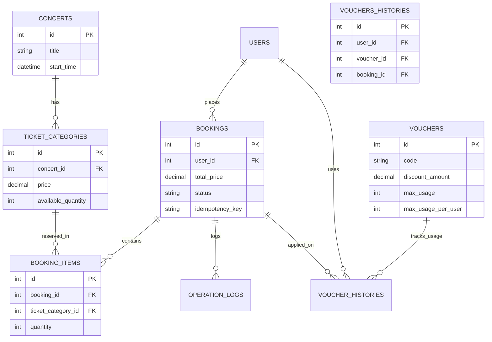

<div align="center">
  <h1>TECHNICAL ASSESSMENT</h1>
  <h3>17/5/2026</h3>
  <h4>Submitted by: Võ Hoàng Trung</h4>
</div>

---

## I. System Design

The system is designed with a Monolithic architecture but strictly separates components based on **Clean Architecture** and **SOLID** principles. The diagram below illustrates the communication flow between the main components:



**Key Architectural Decisions (Trade-offs):**
- **Facade Pattern:** Uses `BookingServiceImpl` as a Facade to coordinate `BookingItemProcessingService` and `VoucherProcessingService`.
- **Concurrency Control:** Utilizes **Database Row Locks (Atomic Update)** instead of Distributed Cache Locks (like Redis) to keep the system lightweight while ensuring correctness under high load (Flash Sales).
- **Idempotency:** Prevents duplicate orders during network failures using `idempotency_key`.

*(For detailed Sequence Diagrams regarding Concurrency, Idempotency, and Voucher Calculation, please refer to the `docs/SEQUENCE_DIAGRAM.md` file).*

## II. Database Design

Core Entity-Relationship Diagram (ERD) of the system:



*Note: The `USERS` table is a logical identifier (assuming an external Identity Provider). Therefore, there is no physical User entity in this Backend codebase.*

## III. Assumptions & Limitations

*(For a detailed description of the reasoning behind design decisions, please see the `ASSUMPTIONS_AND_LIMITATIONS.md` file).*

**Key Points Summary:**
1. **Mock Data (Seeding):** Assumes the Admin has already created Concerts, Tickets, and Vouchers in the database. The system focuses entirely on the Booking Core Flow to solve complex problems. Master Data CRUD APIs (Add/Edit events) have been intentionally omitted.
2. **Authentication (Auth):** The backend trusts the `userId` parameter passed via API (instead of extracting it from a real JWT token, due to scope limitations).
3. **Payment:** The order status update API (`PATCH /api/bookings/{id}/status`) serves as a mock for a Webhook callback from a third-party payment gateway.
4. **No Specific Seat Selection:** Ticket purchasing is currently based on the quantity of a *Ticket Category*, rather than reserving specific seats on a seating chart.

## IV. API Document

The system provides complete automated API documentation **using Swagger / OpenAPI 3.0**.

After successfully running the project, you can access the Swagger UI interface at:
👉 **[http://localhost:8080/swagger-ui/index.html](http://localhost:8080/swagger-ui/index.html)**

In the Swagger UI, reviewers can:
- View the complete list of Endpoints (Concerts, Bookings, Vouchers, Logs).
- Inspect the Schema structures of DTOs (Request / Response).
- Test API calls directly from the Browser (using the *Try it out* button).

## V. Setup Guide

### 1. System Requirements
- Java 17+
- Gradle
- PostgreSQL 13+ (Local or via Docker)

### 2. Database Configuration
Update the Database connection details in the `src/main/resources/application.properties` file:
```properties
spring.datasource.url=jdbc:postgresql://localhost:5432/ticket_booking
spring.datasource.username=postgres
spring.datasource.password=postgres
```
*(The system uses `spring.jpa.hibernate.ddl-auto=update`, so table structures will be automatically created on the first run).*

### 3. Running the Application
Run the following command in the root directory of the project to start the Web Server:
```bash
./gradlew bootRun
```

### 4. Running Unit Tests
The project includes critical Unit Tests (JUnit 5 & Mockito) used to verify complex technical challenges such as Concurrency handling (Overselling) and Voucher Abuse prevention.
```bash
./gradlew test
```

---

# Tài liệu Dự án (Vietnamese Version)

<div align="center">
  <h1>BÀI KIỂM TRA KỸ THUẬT (TECHNICAL ASSESSMENT)</h1>
  <h3>17/5/2026</h3>
  <h4>Người nộp: Võ Hoàng Trung</h4>
</div>

## I. Thiết kế Hệ thống (System Design)

Hệ thống được thiết kế theo kiến trúc Monolithic nhưng phân tách các thành phần một cách nghiêm ngặt dựa trên nguyên lý **Clean Architecture** và **SOLID**. Sơ đồ dưới đây minh họa luồng giao tiếp giữa các thành phần chính (Sơ đồ được giữ nguyên bản tiếng Anh):


**Các quyết định Kiến trúc quan trọng:**
- **Facade Pattern:** Sử dụng `BookingServiceImpl` làm Facade để điều phối `BookingItemProcessingService` và `VoucherProcessingService`.
- **Kiểm soát Truy cập đồng thời:** Sử dụng **Khóa dòng CSDL (Atomic Update)** thay vì Khóa phân tán (như Redis) để giữ hệ thống nhẹ nhàng mà vẫn đảm bảo tính chính xác dưới tải cao (Flash Sales).
- **Tính lũy đẳng (Idempotency):** Ngăn chặn đơn hàng trùng lặp khi gặp lỗi mạng bằng cơ chế `idempotency_key`.

## II. Thiết kế Cơ sở dữ liệu (Database Design)

Sơ đồ Thực thể - Mối quan hệ (ERD) cốt lõi của hệ thống:


## III. Giả định & Giới hạn (Assumptions & Limitations)

*(Để xem mô tả chi tiết về lý do đằng sau các quyết định thiết kế, vui lòng tham khảo file `ASSUMPTIONS_AND_LIMITATIONS.md`).*

**Tóm tắt các điểm chính:**
1. **Dữ liệu giả lập (Seeding):** Giả định Admin đã tạo sẵn Concerts, Tickets và Vouchers trong CSDL. Hệ thống tập trung hoàn toàn vào Luồng cốt lõi Đặt vé. Các API CRUD Master Data đã được lược bỏ.
2. **Xác thực (Auth):** Backend tin tưởng tham số `userId` truyền qua API (thay vì trích xuất từ JWT token thật).
3. **Thanh toán:** API cập nhật trạng thái đơn hàng đóng vai trò giả lập Webhook từ cổng thanh toán.
4. **Không chọn ghế cụ thể:** Việc mua vé dựa trên số lượng của loại vé.

## IV. Tài liệu API (API Document)

Hệ thống cung cấp tài liệu API tự động đầy đủ **sử dụng Swagger / OpenAPI 3.0**.

Truy cập tại: 👉 **[http://localhost:8080/swagger-ui/index.html](http://localhost:8080/swagger-ui/index.html)**

## V. Hướng dẫn Cài đặt (Setup Guide)

### 1. Yêu cầu Hệ thống
- Java 17+
- Gradle
- PostgreSQL 13+ (Chạy local hoặc qua Docker)

### 2. Chạy Ứng dụng
```bash
./gradlew bootRun
```

### 3. Chạy Unit Tests
```bash
./gradlew test
```
