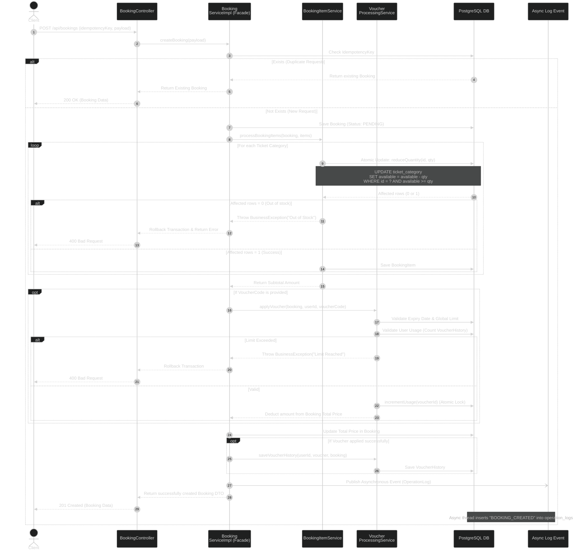
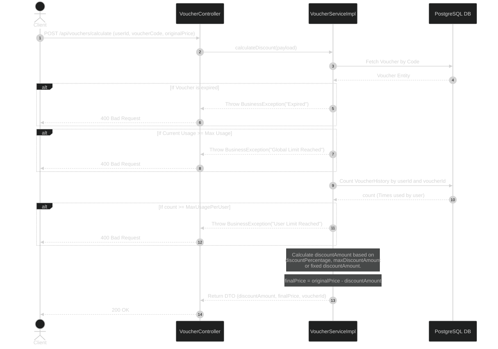
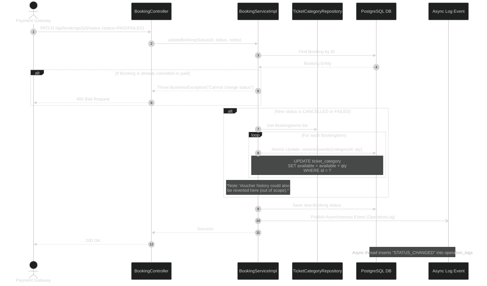

# Sequence Diagrams

This document describes the most critical business flows of the Concert Ticket Booking system, focusing on how we resolve Concurrency (Overselling) and Idempotency (Duplicate Request) risks.

## 1. Core Booking Flow

The main processing flow when a user attempts to reserve tickets. This flow solves 3 major problems:
- **Preventing Duplicate Bookings:** Using the Idempotency-Key mechanism.
- **Preventing Overselling:** Using Atomic Updates at the Database level (`reduceQuantity`).
- **Preventing Voucher Abuse:** Validating the usage history limit (`maxUsagePerUser`) and utilizing DB Locks.

## 2. Calculate Voucher Flow

This flow is invoked *before* the user places an order, enabling the Client to display the discount amount and the final price to be paid, thus enhancing the user experience.

## 3. Payment Status Update Flow

Simulates a Webhook callback from a third-party payment gateway (e.g., VNPay, Momo, Stripe) updating the system.

